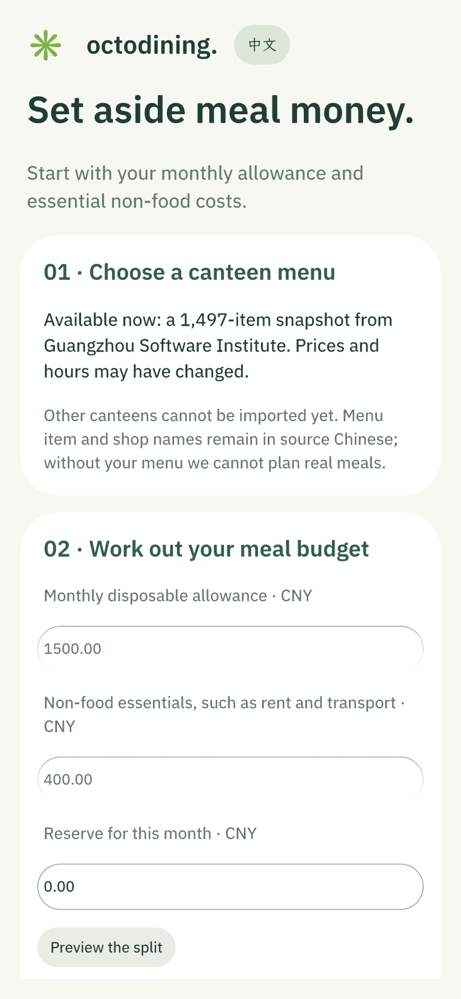
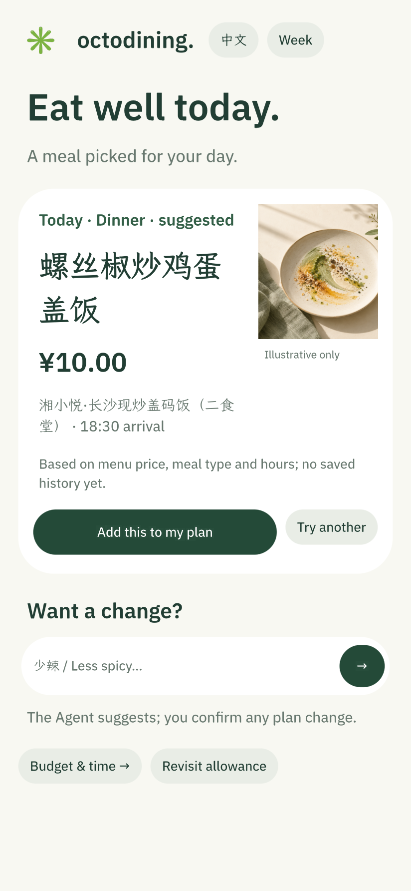
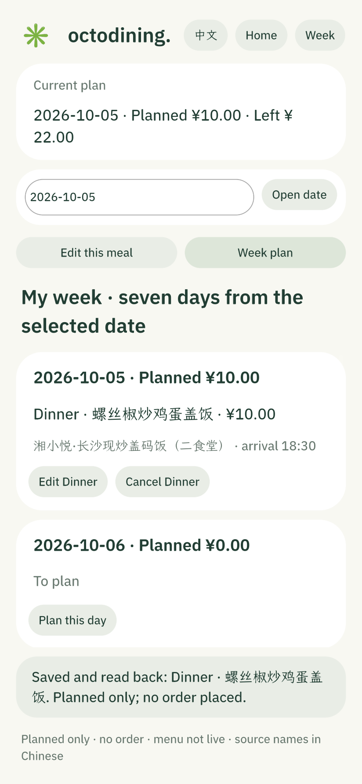

# OctoDining

[中文说明](README.md) · **English**

**Make a limited allowance cover meals you can see, review and change.**

OctoDining is a native OctoSense / OctoScript / Makepad prototype for students and others managing meal costs. On first launch, it estimates a daily meal budget from a monthly disposable allowance, non-food essentials and a reserve. On later launches, it shows today's confirmed meal or suggests one you can add to your plan. You can ask the host's Octos Agent to compare up to three menu candidates; you confirm any plan change yourself.

The app has a **中文 / English** switch in its header. The choice survives a restart. The English UI covers onboarding, today's recommendation, budget and meal controls, the seven-day plan, status messages and Agent prompts. Dish and shop names stay in the original Chinese because the source menu has no verified English translations.

| First-run budget | Today's meal | Seven-day plan |
| :---: | :---: | :---: |
|  |  |  |

These are actual **1.6.0 card-host screenshots**, not mockups. The food image is illustrative, not a photo of the suggested dish. [See the bilingual verification record](docs/evidence/bilingual-160-20261005.md).

The bundled canteen snapshot has 1,497 items from Guangzhou Software Institute. Candidates are filtered by price, meal type, arrival time and a small set of request keywords. Lunch and dinner filtering rejects obvious extras or incomplete dishes using name-based rules; it cannot establish nutrition, portion size or allergen safety. Prices and opening hours are snapshots, not live data. The app does not place orders or take payment. Importing another canteen, automatic collection and filling an entire week are still planned.

The seven-day view shows confirmed meals and empty dates. Plans are stored locally, read back after saving, and can be edited or cancelled. The Octos request is optional; when the Agent service is unavailable, manual candidate selection still works. A real MiniMax-M3 Agent loop was validated in OctoSense Shell for **1.2.2**. The current **1.6.0** UI and fallback have been tested in native card-host, but its Shell/model integration has not yet been revalidated. See [contest readiness](docs/CONTEST_READINESS.md) for the precise evidence and remaining gaps.

To run the native development preview, follow the [official OctoScript quickstart](https://github.com/OctoSense-org/OctoScript-App-Design-Flow/blob/main/docs/QUICKSTART.md), then:

```sh
python3 scripts/build-octos-bundle.py
OCTO_CLI=/path/to/OctoScript-App-Design-Flow/tools/octo
"$OCTO_CLI" check bundle
"$OCTO_CLI" run bundle --port 8141 --detach
```

This `card-host` preview exercises the app without proving that the OctoSense Shell or a live model is connected. `scripts/test-basic-app.py` covers the Chinese meal-planning flow; `scripts/test-language.py` checks English onboarding, candidate confirmation, Agent fallback, persistence and switching back to Chinese. `scripts/capture-card-host.py --language en` captures English native screens in isolated storage.

Source code is under [Apache 2.0](LICENSE-CODE). Menu source and redistribution limits are documented in [data provenance](docs/DATA_PROVENANCE.md); the code license does not grant rights to third-party menu data. See the [privacy notice](docs/PRIVACY.md) for local data and Agent requests.
