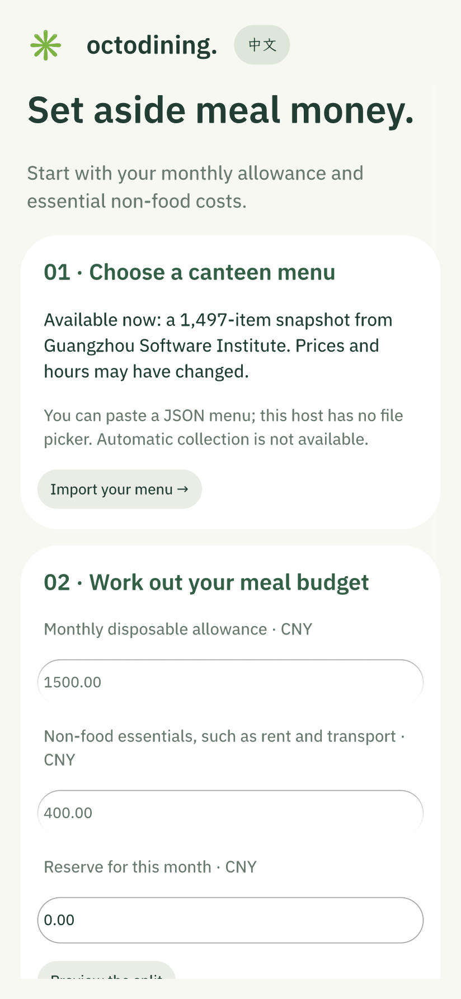
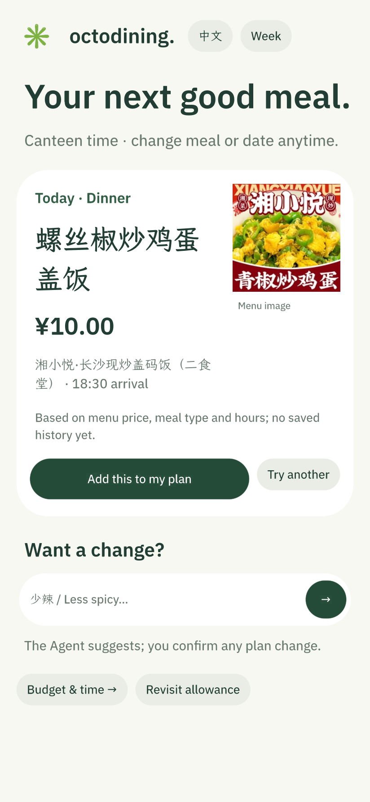
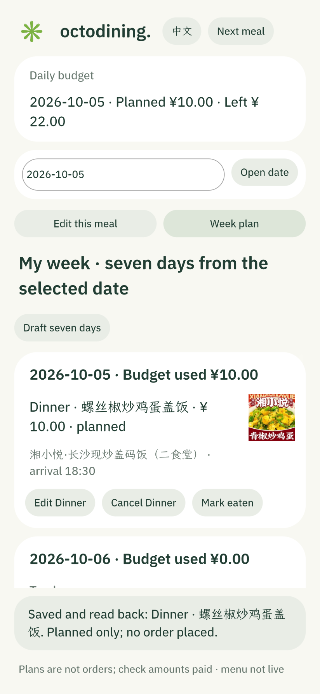

# OctoDining

[中文说明](README.md) · **English**

**Open the app and see your next meal.** OctoDining turns a monthly disposable allowance into a daily dining budget. It shows an existing confirmed meal first, or suggests a canteen dish to review and confirm. You can draft a seven-day plan, change individual meals, and record what you actually paid. An optional Octos Agent can compare up to three real candidates; the user confirms changes.

This is a native **OctoSense / OctoScript / Makepad** prototype for students. It bundles a 1,497-item historical canteen snapshot from Guangzhou Software Institute. On first launch, you can also paste a JSON menu for another canteen. Menu prices, hours and images are snapshots, not proof of live availability, nutrition or allergen safety.

**For judges — the real Agent loop:** [15-second 1.2.2 evidence reel](docs/demo/octodining-122-agent-evidence-reel.mp4) · [original Shell record and three screenshots](docs/evidence/shell-ui122-minimax-20261004.json) · [judging checklist](docs/AGENTIC_JUDGING.md). MiniMax-M3 compared candidates for an existing dinner plan and suggested candidate 3. The user confirmed it; the app persisted and read back the plan. The reel edits actual screenshots; it is not a continuous recording. The separate 1.7.0 Shell run received HTTP 429 and **did not obtain a model suggestion**.

| Onboarding | Next meal | Seven-day plan |
| :---: | :---: | :---: |
|  |  |  |

These are actual **1.7.0 card-host captures**. They do not demonstrate a live model in OctoSense Shell. [Screenshots and checks](docs/evidence/next-meal-170-20261005.md).

[Watch the 35-second evidence reel](docs/demo/octodining-170-evidence-reel.mp4) · [Sources and reproduction](docs/demo/README.md). This is an edit of genuine screenshots with an original synthesized soundtrack, not a continuous screen recording or proof of a successful 1.7.0 model suggestion.

Onboarding asks for monthly disposable allowance, non-food fixed costs and a reserve. It estimates a daily dining budget over 30 days. You can use the bundled menu or paste a JSON menu with a source, update date, time zone, prices and business hours; invalid records are rejected. `scripts/menu-csv-to-json.py` converts a supported CSV into pasteable JSON. The app does not yet have a file picker or automatic collection.

The home screen uses canteen-local time to select the next uneaten meal. The weekly draft skips elapsed meals, shows any gaps and daily totals, and is written only after confirmation. It is **rule-generated, not Agent-generated**. Menu names and stores remain Chinese because no verified translations are available. Bundled product images load from `img.pospal.cn`; custom menus currently use text-only cards.

Version 1.7.0 passed native card-host feature checks. A [same-version Shell run](docs/evidence/shell-170-20261005.md) verified loading, first-use Agent consent, a request entering Octos, and manual save/read-back/restart after the provider returned HTTP 429. **It did not obtain a model suggestion.** A successful real MiniMax loop remains proven for **1.2.2** only. See [contest readiness](docs/CONTEST_READINESS.md). The frozen `qualifier-2026-10-04-final` tag still points to that earlier version.

To run a development preview, follow the [official OctoScript quickstart](https://github.com/OctoSense-org/OctoScript-App-Design-Flow/blob/main/docs/QUICKSTART.md):

```sh
python3 scripts/build-octos-bundle.py
OCTO_CLI=/path/to/OctoScript-App-Design-Flow/tools/octo
"$OCTO_CLI" check bundle
"$OCTO_CLI" run bundle --port 8141 --hidden --detach
```

The card-host preview does not prove Shell Agent integration. Run `python3 scripts/test-basic-app.py`, `python3 scripts/test-language.py`, `python3 scripts/test-week-draft.py` and `python3 scripts/test-custom-menu.py` separately for local feature checks. Code uses [Apache 2.0](LICENSE-CODE); the license does not grant rights to third-party menu data or images. See [data provenance](docs/DATA_PROVENANCE.md) and [privacy](docs/PRIVACY.md).
