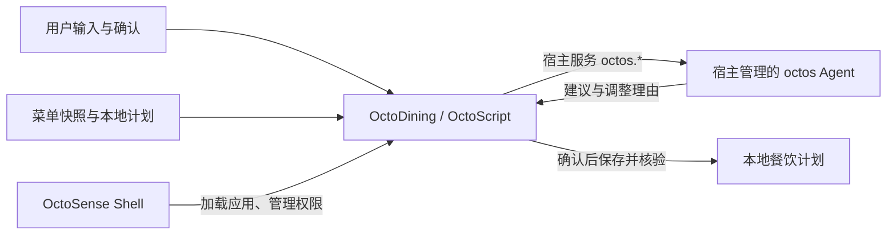

# OctoDining · 今晚吃什么

**让预算有限的人，也能好好吃饭。**

OctoDining 面向打工人、学生和其他需要控制餐饮开销的人，目标是结合预算、口味、已有计划和真实菜单，帮助用户选餐、确认计划并持续调整。广州软件学院食堂菜单是首个数据集，产品范围不限校园。

> **开发状态 · 2026-10-04：** 基本选餐和计划管理已在 OctoScript `card-host` 完成 14 组 UI bridge 检查。OctoDining 1.2.1 已在隔离的 OctoSense Shell 中完成“查找候选 → 请求系统 Agent → 用户确认 → 保存并读回”的运行闭环，系统 Agent 实际使用 MiniMax-M3；另已验证拒绝授权与未配置模型时仍可手动选择。[空计划联调记录](docs/evidence/shell-minimax-clean-20261004.json)证明新建计划；[Shell 截图记录](docs/evidence/shell-minimax-20261004.json)来自另一次同版本、已有计划的运行。详见[参赛准备状态](docs/CONTEST_READINESS.md)。

## 现在有什么

状态按当前代码和真实运行证据更新。

| 内容 | 当前状态 |
| --- | --- |
| 菜单快照 | `products_clean.json` 有 1,497 条商品记录，包含名称、店铺、类别、标价与营业时段 |
| 六档预算与三餐 | A1–A6、早餐/午餐/晚餐、餐次上限和每日预算已进入 OctoScript |
| 菜单候选 | 1,497 条快照，按价格、到店时间、餐次与关键词避辣筛选，展示最多三个店铺 |
| 计划管理 | 按日期保存；支持同餐替换、查看、修改、取消、日预算调整和重启恢复；写入后读回核验，双份记录容错 |
| 自动验收 | `python3 scripts/test-basic-app.py` 完整通过 14 组 UI bridge 检查；[公开报告](docs/evidence/basic-app-20261004.json)记录了测试项与当时的 1.2.1 包摘要，测试时工作树尚未冻结 |
| OctoSense Agent | 页面请求前重验条件，校验当前候选序号；条件变化会使未完成回调失效，解析要求 JSON 对象、数字序号和字符串理由；仍须用户点候选确认。Shell 已用 MiniMax-M3 验证真实请求、界面建议及保存读回，也验证拒绝授权及未配置模型时可继续手动选择 |
| 暂未包含 | 周计划、历史去重、实时价格/库存、营养与过敏信息、下单和支付 |
| 商店资料 | `listing.json` 已改为项目内容，平台只列已实测 Linux；两张截图来自 card-host 实机画面，发布者身份与菜单再分发许可须核对 |

菜单是本地快照，候选筛选是规则过滤，不代表实时库存、现价或当天营业状态。任何菜单文本也不能证明辣度、营养或过敏原安全。

## 技术路线



- **OctoSense Shell** 是主要目标宿主。应用使用 OctoScript，由 Makepad 渲染。
- **octos** 是运行时 Agent 内核，模型配置与密钥由宿主管理。
- **card-host / tools/octo** 用于界面、交互和包检查；开发预览不能证明系统 Agent 已接通。
- **Rinx** 保留为聊天分享方向的可选宿主，不作为当前个人餐饮流程的前置条件。
- 网页和 Rust/egui 原型用于保留既有功能、算法与设计资产。

官方资料与版本边界见 [架构说明](docs/ARCHITECTURE.md)。八个生态项目并非必须全部集成；宿主选择以实际任务和运行验证为依据。

## 迭代顺序

1. **基本功能（已完成开发预览验收）。** 六档预算、三餐候选、保存/替换/修改/取消、日期与预算核算、重启恢复和存储失败保护。
2. **系统 Agent（已完成首轮真实模型验收）。** 宿主 Agent 经 MiniMax-M3 比较当前候选并解释取舍；Shell 中的真实模型闭环及拒绝/无模型回退已验证。菜品、价格与计划变更由应用校验，最终选择由用户确认。
3. **完善 UI 与交付。** 核对不同窗口尺寸与可读性，采集当前版本真实截图，补齐资料和可复现演示。

每一步的验收条件见 [开发路线](docs/ROADMAP.md)。

## 开发预览

按 [官方快速上手](https://github.com/OctoSense-org/OctoScript-App-Design-Flow/blob/main/docs/QUICKSTART.md) 准备工具工作区。以下仅用于 `card-host` 开发预览，不会启动 OctoSense Shell 或系统 Agent。

```sh
git clone https://github.com/windy664/OctoDining.git
cd OctoDining

# 改成自己的工具路径。此命令运行 card-host，仅用于无 Agent 的功能预览。
OCTO_CLI=/path/to/OctoScript-App-Design-Flow/tools/octo
python3 scripts/build-octos-bundle.py
"$OCTO_CLI" check bundle
"$OCTO_CLI" run bundle --port 8141 --hidden --detach
curl --fail http://127.0.0.1:8141/snap
curl --fail http://127.0.0.1:8141/quit
```

`8141` 是测试控制接口，应用显示在原生窗口中；需要可见窗口时去掉 `--hidden`。两张包内截图由 `python3 scripts/capture-card-host.py` 通过 Makepad framebuffer 生成，脚本同时检查候选和保存状态；它们证明 card-host 画面。另有两张真实 MiniMax 联调的 Shell 截图位于 `docs/evidence/`。已有 `scripts/preview.sh` 和 `start-demo.sh` 包含机器相关行为，不是 OctoSense Shell 启动入口。

OctoSense Shell 的真实 MiniMax 闭环及早期 mock 基线均有记录；固定提交号和未验证部分见[参赛准备状态](docs/CONTEST_READINESS.md)。历史网页与 Rust 原型可单独检查：

```sh
node scripts/smoke-web-demo.cjs
cargo test --offline
cargo run --offline -- --verify-data
```

Rust 检查需要已有依赖缓存。这些检查覆盖历史原型，不能代替 OctoScript、宿主与 Agent 验收。

## 文档与代码

| 入口 | 用途 |
| --- | --- |
| [产品任务](docs/BRIEF.md) | 用户、范围与完成标准 |
| [架构](docs/ARCHITECTURE.md) | 宿主、Agent、工具与版本依据 |
| [开发路线](docs/ROADMAP.md) | 工作顺序与验收条件 |
| [Agent 任务](docs/AGENT-TASKS.md) | Agent、应用和用户的职责 |
| [参赛准备状态](docs/CONTEST_READINESS.md) | 当前证据、缺口与提交材料 |
| [接续记录](docs/CONTINUATION.md) | 历史实现与路线变化 |
| `scripts/main.splash.in` → `bundle/main.splash` | 应用源码模板 → 嵌入菜单的生成产物 |
| `products_clean.json`、`all_menus.json`、`menus/`、`menu.csv` | 清洗菜单与原始数据资产 |
| `meal_planner.html`、`src/` | 网页与 Rust 原型 |

## 数据与许可

源码采用 [Apache License 2.0](LICENSE-CODE)。菜单快照来自原项目整理的广州软件学院食堂数据；已核实的文件事实、缺失的来源凭据及再分发授权见[菜单来源说明](docs/DATA_PROVENANCE.md)。代码许可证不代表取得第三方数据许可。应用数据处理见[隐私说明](docs/PRIVACY.md)，字体许可见 [assets/fonts/LICENSE.txt](assets/fonts/LICENSE.txt)。

应用当前没有外卖平台接口、下单、支付或配送能力，也没有可核验的营养与过敏原数据。运行时凭据留在宿主或本地忽略文件中。
