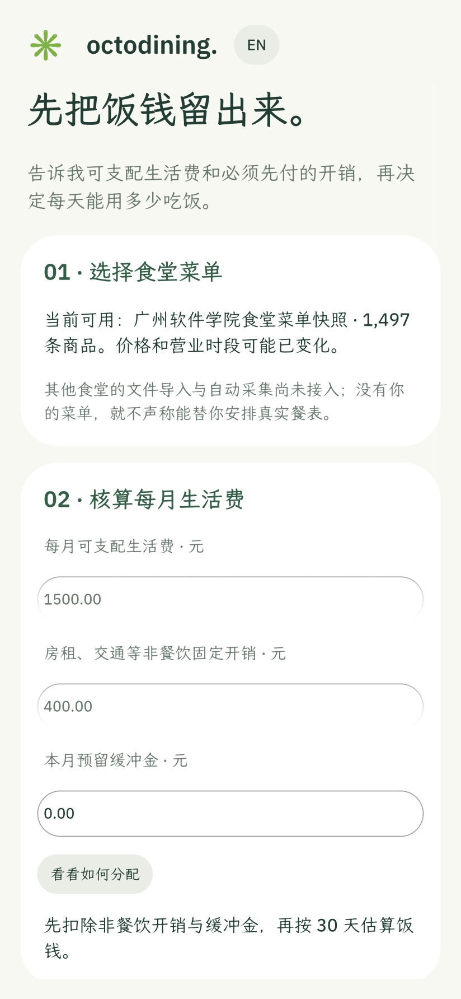
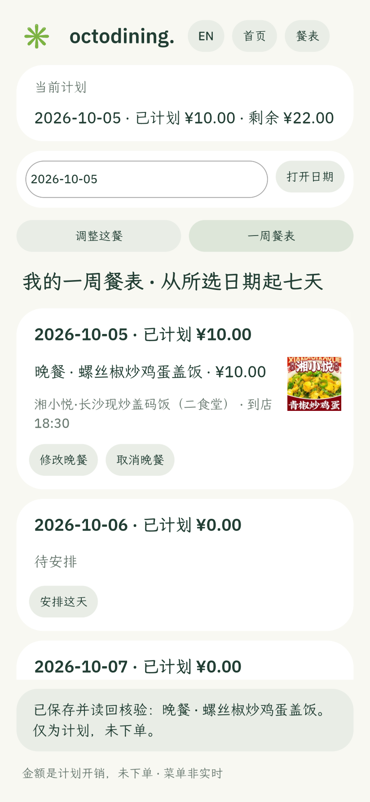
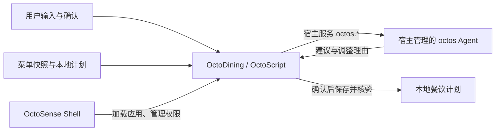

# OctoDining（好好吃饭）

**中文** · [English README](README.en.md)

**让有限的生活费，变成看得见、改得动的每一餐。**

每天都要吃饭，却很少有人愿意每天重新算一遍钱、翻一遍菜单。便宜不一定是一顿像样的正餐，推荐也不该替人做完决定。OctoDining 想把这些琐碎选择连成一个能核对的过程：先从生活费里留出饭钱，再用食堂菜单安排餐次；打开应用就看到今天吃什么，不合适时让 Agent 在可用候选中解释并调整，最后由自己确认。

这是一个基于 **OctoSense、OctoScript 与 Makepad** 的原生应用原型，面向学生和其他需要控制餐饮开销的人。首份数据是广州软件学院食堂的菜单快照；产品希望将来支持用户自己的食堂菜单。

| 首次使用：先留饭钱 | 日常打开：先看今天吃什么 | 一周餐表：确认与调整 |
| :---: | :---: | :---: |
|  |  |  |

以上为 **1.6.2 原生 `card-host` 实际截图**，不是概念图；[中英文图片与无图状态实机记录](docs/evidence/no-placeholder-162-20261005.md)也已更新。界面只显示 `menu.csv` 对应的商品配图，可能是菜单宣传图而非实拍；无专属图时显示纯文字卡片。一周餐表目前展示已确认内容，尚不自动排满整周。

> **当前进度 · 1.6.2：** 已加入可记住选择的中文 / English 切换；首页、候选和一周餐表按商品加载菜单配图，没有专属图时显示纯文字卡片。首次预算设置、今日推荐、确认与读回已经运行；外部菜单导入、整周自动规划及本版 Shell 模型复验仍待完成。[产品流程](docs/PRODUCT_POSITIONING.md) · [验收证据与缺口](docs/CONTEST_READINESS.md)

## 现在有什么

状态按当前代码和真实运行证据更新。

| 内容 | 当前状态 |
| --- | --- |
| 菜单快照 | `products_clean.json` 有 1,497 条商品记录；构建时按原始顺序关联 `menu.csv`，其中 1,209 条有非默认商品图链接 |
| 首次引导 | 选择内置广州软件学院食堂快照，输入每月生活费、固定开销和缓冲金，按 30 天估算日餐饮预算并持久化；外部食堂表导入尚未接入 |
| 中英文界面 | 顶栏切换中文 / English，重启后保持；覆盖引导、推荐、计划及 Agent 提示，菜名和店名保留数据源中文 |
| 六档预算与三餐 | A1–A6、早餐/午餐/晚餐、餐次上限和每日预算已进入 OctoScript |
| 菜单候选 | 1,497 条快照，按价格、到店时间、餐次与关键词避辣筛选，展示最多三个店铺 |
| 首页推荐 | 优先显示今天已确认的餐品；否则从菜单抽样，按预算、餐次与到店时段匹配，可一键加入餐表或换一道。午晚餐排除加料、纯主食和明显缺少主菜线索的条目；这是菜名启发式，不能证明份量或营养。有历史计划时降低重复菜品和店铺的优先级。首页、候选和餐表的商品图由 `img.pospal.cn` 在线加载；无专属图时只显示文字，菜单图片不保证是实拍或与菜名完全一致 |
| 计划管理 | 按日期保存；支持同餐替换、查看、修改、取消、日预算调整和重启恢复；写入后读回核验，双份记录容错 |
| 一周餐表 | 从所选日期起展示七天的已确认餐次与空白日；可从空白日进入安排，当前不自动生成整周菜单 |
| 自动验收 | 1.6.2 的 `python3 scripts/test-basic-app.py` 和 `python3 scripts/test-language.py` 覆盖中英文交互、有图与无图状态；原生截图见[本版记录](docs/evidence/no-placeholder-162-20261005.md) |
| OctoSense Agent | 页面请求前重验条件，校验当前候选序号；条件变化会使未完成回调失效，解析要求 JSON 对象、数字序号和字符串理由；仍须用户点候选确认。1.2.2 曾在 Shell 用 MiniMax-M3 验证真实请求、建议和保存读回；1.6.2 尚未同版复验 |
| 暂未包含 | 外部食堂表导入、自动采集、整周自动排餐、实时价格/库存、营养与过敏信息、下单和支付 |
| 商店资料 | `listing.json` 已改为项目内容，平台只列已实测 Linux；六张截图来自 card-host 原生画面，发布者身份与菜单再分发许可须核对 |

菜单是本地快照，候选筛选是规则过滤，不代表实时库存、现价或当天营业状态。任何菜单文本也不能证明辣度、营养或过敏原安全。

## 技术路线



- **OctoSense Shell** 是主要目标宿主。应用使用 OctoScript，由 Makepad 渲染。
- **octos** 是运行时 Agent 内核，模型配置与密钥由宿主管理。
- **card-host / tools/octo** 用于界面、交互和包检查；开发预览不能证明系统 Agent 已接通。
- **Rinx** 保留为聊天分享方向的可选宿主，不作为当前个人餐饮流程的前置条件。
- 网页和 Rust/egui 原型用于保留既有功能、算法与设计资产。

官方资料与版本边界见 [架构说明](docs/ARCHITECTURE.md)。八个生态项目并非必须全部集成；宿主选择以实际任务和运行验证为依据。

## 迭代顺序

1. **基本功能（已完成开发预览验收）。** 六档预算、三餐候选、保存/替换/修改/取消、日期与预算核算、重启恢复和存储失败保护。
2. **系统 Agent（已完成首轮真实模型验收）。** 宿主 Agent 经 MiniMax-M3 比较当前候选并解释取舍；Shell 中的真实模型闭环及拒绝/无模型回退已验证。菜品、价格与计划变更由应用校验，最终选择由用户确认。
3. **补齐首次使用和餐表规划（1.6.2 进行中）。** 首次生活费核算、中英文界面与商品配图已可运行；外部菜单导入、整周草案、用户确认和同版 Shell Agent 复验仍待完成。首屏继续优先呈现今天已安排或可确认的餐品。

每一步的验收条件见 [开发路线](docs/ROADMAP.md)。

## 开发预览

按 [官方快速上手](https://github.com/OctoSense-org/OctoScript-App-Design-Flow/blob/main/docs/QUICKSTART.md) 准备工具工作区。以下仅用于 `card-host` 开发预览，不会启动 OctoSense Shell 或系统 Agent。

```sh
git clone https://github.com/windy664/OctoDining.git
cd OctoDining

# 改成自己的工具路径。此命令运行 card-host，仅用于无 Agent 的功能预览。
OCTO_CLI=/path/to/OctoScript-App-Design-Flow/tools/octo
python3 scripts/build-octos-bundle.py
"$OCTO_CLI" check bundle
"$OCTO_CLI" run bundle --port 8141 --hidden --detach
curl --fail http://127.0.0.1:8141/snap
curl --fail http://127.0.0.1:8141/quit
```

`8141` 是测试控制接口，应用显示在原生窗口中；需要可见窗口时去掉 `--hidden`。包内截图由 `python3 scripts/capture-card-host.py` 通过 Makepad framebuffer 生成，脚本同时检查候选和保存状态；它们证明 card-host 画面。1.2.2 的真实 MiniMax 建议、滚动和确认截图位于 `docs/evidence/`。已有 `scripts/preview.sh` 和 `start-demo.sh` 包含机器相关行为，不是 OctoSense Shell 启动入口。

OctoSense Shell 的真实 MiniMax 闭环及早期 mock 基线均有记录；固定提交号和未验证部分见[参赛准备状态](docs/CONTEST_READINESS.md)。历史网页与 Rust 原型可单独检查：

```sh
node scripts/smoke-web-demo.cjs
cargo test --offline
cargo run --offline -- --verify-data
```

Rust 检查需要已有依赖缓存。这些检查覆盖历史原型，不能代替 OctoScript、宿主与 Agent 验收。

## 文档与代码

| 入口 | 用途 |
| --- | --- |
| [产品任务](docs/BRIEF.md) | 用户、范围与完成标准 |
| [产品流程](docs/PRODUCT_POSITIONING.md) | 新手引导、预算分配、周餐表与 Agent 职责 |
| [架构](docs/ARCHITECTURE.md) | 宿主、Agent、工具与版本依据 |
| [开发路线](docs/ROADMAP.md) | 工作顺序与验收条件 |
| [Agent 任务](docs/AGENT-TASKS.md) | Agent、应用和用户的职责 |
| [参赛准备状态](docs/CONTEST_READINESS.md) | 当前证据、缺口与提交材料 |
| [接续记录](docs/CONTINUATION.md) | 历史实现与路线变化 |
| `scripts/main.splash.in` → `bundle/main.splash` | 应用源码模板 → 嵌入菜单的生成产物 |
| `products_clean.json`、`all_menus.json`、`menus/`、`menu.csv` | 清洗菜单与原始数据资产 |
| `meal_planner.html`、`src/` | 网页与 Rust 原型 |

## 数据与许可

源码采用 [Apache License 2.0](LICENSE-CODE)。菜单快照来自原项目整理的广州软件学院食堂数据；已核实的文件事实、缺失的来源凭据及再分发授权见[菜单来源说明](docs/DATA_PROVENANCE.md)。代码许可证不代表取得第三方数据许可。应用数据处理见[隐私说明](docs/PRIVACY.md)，字体许可见 [assets/fonts/LICENSE.txt](assets/fonts/LICENSE.txt)。

应用当前没有外卖平台接口、下单、支付或配送能力，也没有可核验的营养与过敏原数据。运行时凭据留在宿主或本地忽略文件中。
