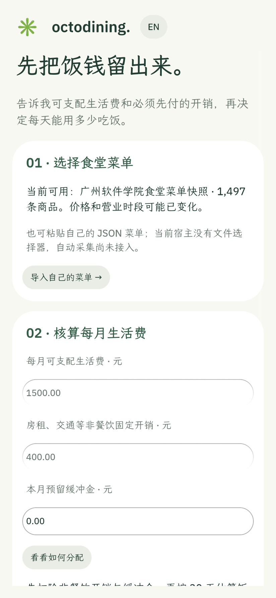
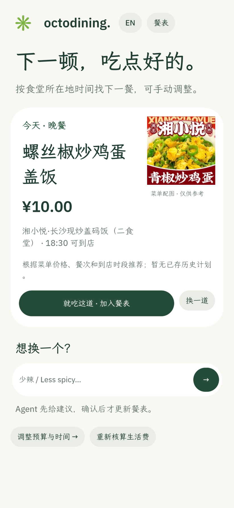
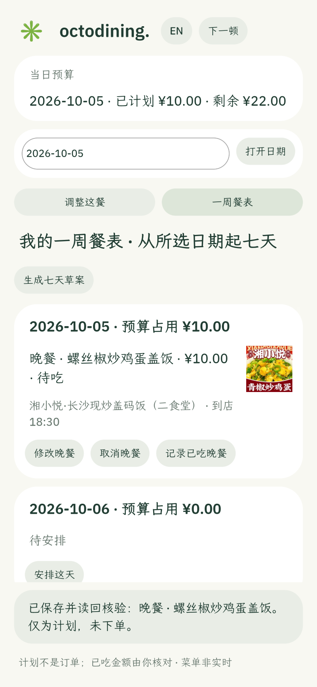

# OctoDining · 好好吃饭

**中文** · [English](README.en.md)

打开就知道下一餐吃什么。OctoDining 把每月可支配生活费变成每日餐饮预算，再从食堂菜单中给出能核对、能更换、能确认的餐食建议。已有餐表时首页优先显示原计划；没有计划时推荐一道。用户也能生成七日草案、逐餐修改，并记录实际花费。Agent 可以比较当前真实候选，重要变更仍由用户确认。

这是面向学生的 **OctoSense / OctoScript / Makepad** 原生应用原型。随包菜单是广州软件学院的 1,497 条历史快照；也可在首次引导粘贴自己食堂的菜单 JSON。价格、时段和配图不代表实时可售、营养或过敏安全。

| 首次使用 | 下一餐 | 七日餐表 |
| :---: | :---: | :---: |
|  |  |  |

以上为 1.7.0 **card-host 原生运行截图**；不是 OctoSense Shell 的模型联调证据。[更多截图与验证](docs/evidence/next-meal-170-20261005.md)。

## 当前可做

- **首次设置：** 输入每月可支配生活费、非餐饮固定开销和缓冲金，按 30 天估算每日饭钱。选择内置菜单，或粘贴带来源、更新日期、UTC 时区、价格和营业时段的 JSON；无效或重复数据会被拒绝。`scripts/menu-csv-to-json.py` 可把指定 CSV 转成可粘贴 JSON。当前没有应用内文件选择器或自动抓取。
- **下一餐：** 按食堂当地时间找未吃的下一餐，先显示已确认计划，否则提供预算内推荐；可换菜、查看候选、确认或记录实际消费，超支如实显示。单餐页允许请求宿主 Octos Agent 比较最多三个候选；无模型仍能手动选择。
- **七日餐表：** 生成草案、查看缺口和每日预算，确认后一次写入并读回；可逐餐修改、取消、撤销已吃记录。草案由应用规则生成，不声称是 Agent 编排。候选排除明显加料、纯主食和小份，但无法证明份量或营养。
- **双语和图片：** 界面可切中文 / English 并持久化；菜名和店名仍为数据源中文。内置菜单 1,209 条商品有关联的非默认图片 URL，按商品加载；无图则显示文字。用户导入的菜单目前不加载外部图片。

1.7.0 的卡片宿主功能测试已通过。[同版 Shell 测试](docs/evidence/shell-170-20261005.md)确认应用加载、Agent 首次授权、请求进入 Octos，以及模型限流时的人工选择、保存读回与重启恢复；这次供应商返回 429，**没有得到模型建议**。真实 MiniMax 建议的完整联调证据仍属于 1.2.2。已冻结的 `qualifier-2026-10-04-final` 标签仍指向旧版，不因开发版更新而改写。

## 运行开发预览

依照[官方 OctoScript 快速上手](https://github.com/OctoSense-org/OctoScript-App-Design-Flow/blob/main/docs/QUICKSTART.md)准备 `tools/octo`，然后运行：

```sh
python3 scripts/build-octos-bundle.py
OCTO_CLI=/path/to/OctoScript-App-Design-Flow/tools/octo
"$OCTO_CLI" check bundle
"$OCTO_CLI" run bundle --port 8141 --hidden --detach
curl --fail http://127.0.0.1:8141/snap
curl --fail http://127.0.0.1:8141/quit
```

这启动的是 card-host 开发预览，不能证明 Shell Agent 接通。功能验收可分别运行 `python3 scripts/test-basic-app.py`、`python3 scripts/test-language.py`、`python3 scripts/test-week-draft.py` 和 `python3 scripts/test-custom-menu.py`；预览宿主一次只启动一个测试。

应用源码模板为 `scripts/main.splash.in`，`bundle/main.splash` 是嵌入菜单后的生成文件；`bundle/` 是 App Hub 检查对象。OctoSense Shell 是目标宿主，Rinx 聊天分享是可选扩展。架构与边界见[架构说明](docs/ARCHITECTURE.md)，产品流程见[产品定位](docs/PRODUCT_POSITIONING.md)，隐私见[数据说明](docs/PRIVACY.md)。

代码采用 [Apache 2.0](LICENSE-CODE)。内置菜单的来源凭据与再分发授权仍待核对，见[数据来源说明](docs/DATA_PROVENANCE.md)；代码许可不涵盖第三方菜单与图片。当前没有订餐、付款、实时库存、营养或过敏原核验。
