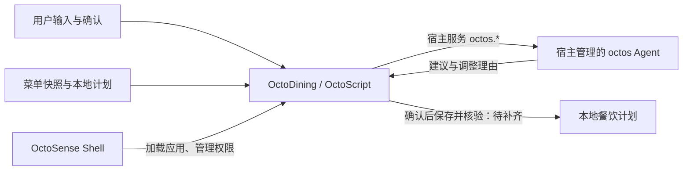

# OctoDining · 今晚吃什么

**让预算有限的人，也能好好吃饭。**

OctoDining 面向打工人、学生和其他需要控制餐饮开销的人，目标是结合预算、口味、已有计划和真实菜单，帮助用户选餐、确认计划并持续调整。广州软件学院食堂菜单是首个数据集，产品范围不限校园。

> **开发状态 · 2026-10-03：** 当前是需要整理的原型。开发主线选择 **OctoSense Shell + OctoScript 应用 + 系统 octos Agent**，先验证本机宿主再固定版本。尚未完成这条路线的端到端运行，不能视为可直接提交的成品。

## 现在有什么

以下状态来自当前源码与数据核对；“已有代码”不代表本次已完成运行验收。

| 内容 | 当前状态 |
| --- | --- |
| 菜单快照 | `products_clean.json` 有 1,497 条商品记录，包含名称、店铺、类别、标价与营业时段 |
| 晚餐候选 | OctoScript 已有预算、到店时间、关键词避辣筛选，最多展示三个不同店铺的候选 |
| 用户确认 | 有写入 `tonight.json` 的代码；尚无保存后读回核验、重启恢复与历史管理 |
| Agent 请求 | 源码调用 `octos.turn.start`，但 manifest 缺少该权限，宿主链路待修复与验证 |
| A1–A6 与周计划 | 网页和 Rust 原型中保留；尚未完整迁入 OctoScript 应用 |
| UI 与商店资料 | 品牌文案与生成模板不同步；listing 仍是笔记应用模板，截图需重新验收 |

计划历史、剩余预算、不重样、价格追踪、采购清单、天气与日历联动都不能作为当前已完成功能宣传。菜单是本地快照，不代表实时库存、现价或当天营业状态。

## 技术路线



- **OctoSense Shell** 是主要目标宿主。应用使用 OctoScript，由 Makepad 渲染。
- **octos** 是运行时 Agent 内核，模型配置与密钥由宿主管理。
- **card-host / tools/octo** 用于界面、交互和包检查；开发预览不能证明系统 Agent 已接通。
- **Rinx** 保留为聊天分享方向的可选宿主，不作为当前个人餐饮流程的前置条件。
- 网页和 Rust/egui 原型用于保留既有功能、算法与设计资产。

官方资料与版本边界见 [架构说明](docs/ARCHITECTURE.md)。八个生态项目并非必须全部集成；宿主选择以实际任务和运行验证为依据。

## 现在先做什么

1. **确定能运行的宿主基线。** 修复模板、bundle 和权限不一致，验证 OctoSense Shell 能加载应用，记录依赖提交号及 Linux 运行结果。
2. **补齐基本功能。** 迁入六档预算，完成选餐、确认保存、重新打开读取、修改或取消，以及计划预算核算。
3. **接通系统 Agent。** 由宿主配置 provider，验证授权、真实请求、结果核验和不可用状态；让已有计划参与下一次建议。
4. **再完善 UI 和交付。** 在同一冻结版本采集截图、日志与演示，填写真实应用资料。

每一步的验收条件见 [开发路线](docs/ROADMAP.md)。首个目标是一次可靠的“预算内选餐 → 确认 → 保存 → 读回”流程。

## 开发预览

按 [官方快速上手](https://github.com/OctoSense-org/OctoScript-App-Design-Flow/blob/main/docs/QUICKSTART.md) 准备工具工作区。以下仅用于 `card-host` 开发预览，不会启动 OctoSense Shell 或系统 Agent。

```sh
git clone https://github.com/windy664/OctoDining.git
cd OctoDining

# 改成自己的工具路径；先完成 ROADMAP 的 P0 修复，再生成正式 bundle。
OCTO_CLI=/path/to/OctoScript-App-Design-Flow/tools/octo
python3 scripts/build-octos-bundle.py
"$OCTO_CLI" check bundle
"$OCTO_CLI" run bundle --port 8141 --hidden --detach
curl --fail http://127.0.0.1:8141/snap
curl --fail http://127.0.0.1:8141/quit
```

目前生成命令会把模板旧标题写回 bundle，检查也可能暴露资料问题。`8141` 是测试控制接口，应用显示在原生窗口中；需要可见窗口时去掉 `--hidden`。已有 `scripts/preview.sh` 包含开发机器绝对路径并会关闭 8141 上的预览；`start-demo.sh` 是历史 Rinx 启动脚本。两者都不是当前目标宿主的正式启动入口。

OctoSense Shell 的固定版本和经过验证的启动步骤仍待 P0 补齐，不提供未经验证的一键启动承诺。已有原型可单独检查：

```sh
node scripts/smoke-web-demo.cjs
cargo test --offline
cargo run --offline -- --verify-data
```

Rust 检查需要已有依赖缓存。这些检查覆盖历史原型，不能代替 OctoScript、宿主与 Agent 验收。

## 文档与代码

| 入口 | 用途 |
| --- | --- |
| [产品任务](docs/BRIEF.md) | 用户、范围与完成标准 |
| [架构](docs/ARCHITECTURE.md) | 宿主、Agent、工具与版本依据 |
| [开发路线](docs/ROADMAP.md) | 工作顺序与验收条件 |
| [Agent 任务](docs/AGENT-TASKS.md) | Agent、应用和用户的职责 |
| [参赛准备状态](docs/CONTEST_READINESS.md) | 当前证据、缺口与提交材料 |
| [接续记录](docs/CONTINUATION.md) | 历史实现与路线变化 |
| `scripts/main.splash.in` → `bundle/main.splash` | 应用源码模板 → 嵌入菜单的生成产物 |
| `products_clean.json`、`all_menus.json`、`menus/`、`menu.csv` | 清洗菜单与原始数据资产 |
| `meal_planner.html`、`src/` | 网页与 Rust 原型 |

## 数据与许可

源码采用 [Apache License 2.0](LICENSE-CODE)。菜单快照来自原项目整理的广州软件学院食堂数据；精确采集日期、来源凭据和再分发授权仍需补全，代码许可证不代表取得第三方数据许可。字体许可见 [assets/fonts/LICENSE.txt](assets/fonts/LICENSE.txt)。

应用当前没有外卖平台接口、下单、支付或配送能力，也没有可核验的营养与过敏原数据。运行时凭据留在宿主或本地忽略文件中。
