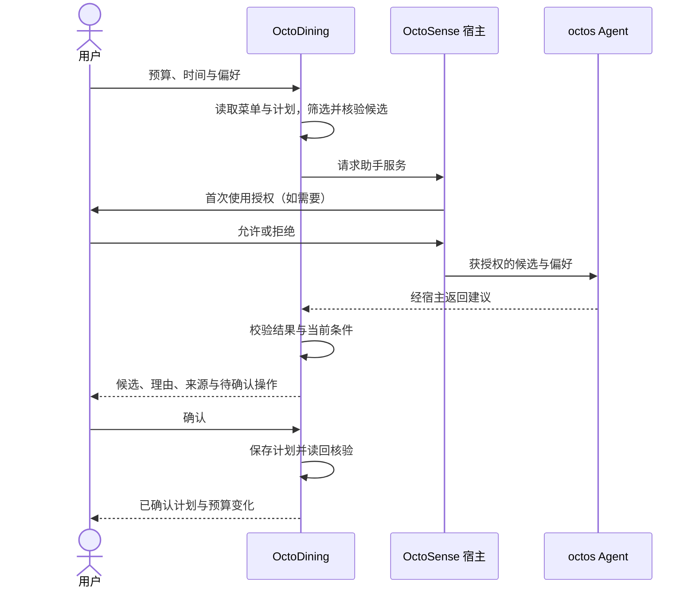

# 技术路线与宿主选择

路线决策日期：2026-10-03。**OctoSense Shell 是优先验证的主宿主；尚未完成本机端到端验收。**

## 各组件的责任

| 组件 | 在 OctoDining 中的角色 |
| --- | --- |
| OctoDining | 餐饮任务、界面、数据核验与本地计划 |
| OctoScript / Makepad | 描述界面、状态、事件，并原生渲染 |
| OctoSense Shell | 加载应用，管理权限、模型配置与系统 Agent |
| octos | 运行时 Agent 内核；通过宿主服务接入 |
| App Hub / Design Flow | 包规范、生成、预览与准入检查 |
| card-host | 开发用隔离运行器，不提供系统 Agent 服务 |
| Rinx | 可选的小程序与会话宿主，用于后续聊天分享和协作 |
| octoscode / OctoLoop / hagency | 按需使用的开发和协作工具，不是全部必装的运行时依赖 |

个人选餐任务目前不需要 Matrix 会话，因此先验证直接运行在 OctoSense 中的应用。Rinx 与 OctoSense 属于同一生态；选择一个主要宿主并不保证 bundle 无需适配就能在另一个宿主运行。

## 目标数据流

这是目标流程；当前 bundle 尚无计划读回和完整的结果约束校验。`octos.turn.start` 返回文字也不意味着 Agent 已具备操作本应用的工具。

## 官方资料中的版本差异

截至此次核对，Design Flow 的 AI-SERVICES 仍有基于 9/27 的“脚本应用没有助手服务”描述；OctoSense 主仓库文档已经记录后续能力：

- 脚本应用可请求 `octos.*`，需宿主运行内核、开启 `OCTOSENSE_CONTAINED_APPS=1`，并取得用户首次使用同意。
- `model.complete` 已有一次性模型调用实现；它没有工具、历史或记忆，不应等同于完整 Agent。
- 应用工具注册、触发器等能力仍有规划或集成限制，不能仅凭 manifest 能被接受就视为运行时可用。

以上是官方文档与合并记录所支持的技术依据，不是本项目的实机验证。应按选择的宿主提交号再核对接口和限制；不要通过开启开发者自动审批来代替正常授权流程。

## 当前源码约束

- `scripts/main.splash.in` 是应维护的模板；`products_clean.json` 是数据输入；生成脚本写出 `bundle/main.splash`。
- 当前模板和 bundle 的两行品牌文案不同，重新生成会覆盖品牌更新。
- 当前调用 `octos.turn.start`，manifest 却仅声明 `storage`、`net` 及 `api.deepseek.com`。修复应以实际采用的宿主服务为准，移除不用的网络权限。
- 成功标签仍写作 Rinx；失败分支隐藏具体错误，只显示本地规则回退。正式联调需要保留可诊断且不含凭据的错误信息。
- 计划写入目前没有读回验证、恢复或失败反馈，不能宣传完整持久化流程。

## 运行环境状态

当前开发机器是 Linux。已有 App Hub、Design Flow、Rinx 与 octos 工作区，尚无本项目验证过的 OctoSense Shell 基线。需要先获取或定位宿主源码，按其锁定依赖构建，验证应用加载与助手可用性，再记录提交号、构建特性和启动命令。

界面预览使用 `tools/octo run`；其 HTTP 端口是 UI 树、点击和截图的测试桥。可通过 UI 树驱动交互，并检查真实截图。Makepad Studio / 测试桥属于开发验证工具，不替代应用运行时 Agent。

## 来源

- [赛事提交说明](https://github.com/gosimfoundation/hackathon-agenticapp26/blob/main/docs/app-hub-submission.md)：主要基线、作品形态和运行证据。
- [OctoSense AI 服务](https://github.com/OctoSense-org/OctoSense/blob/main/docs/ai-services.zh-CN.md)：宿主服务、授权和当前限制。
- [model.complete 合并记录 #95](https://github.com/OctoSense-org/OctoSense/pull/95)：2026-09-28 合入。
- [应用开发流程](https://github.com/OctoSense-org/OctoScript-App-Design-Flow/blob/main/README.zh-CN.md)：bundle、card-host 和发布流程。
- [赛事项目说明](https://github.com/gosimfoundation/hackathon-agenticapp26)：八个生态项目不要求全部集成。
