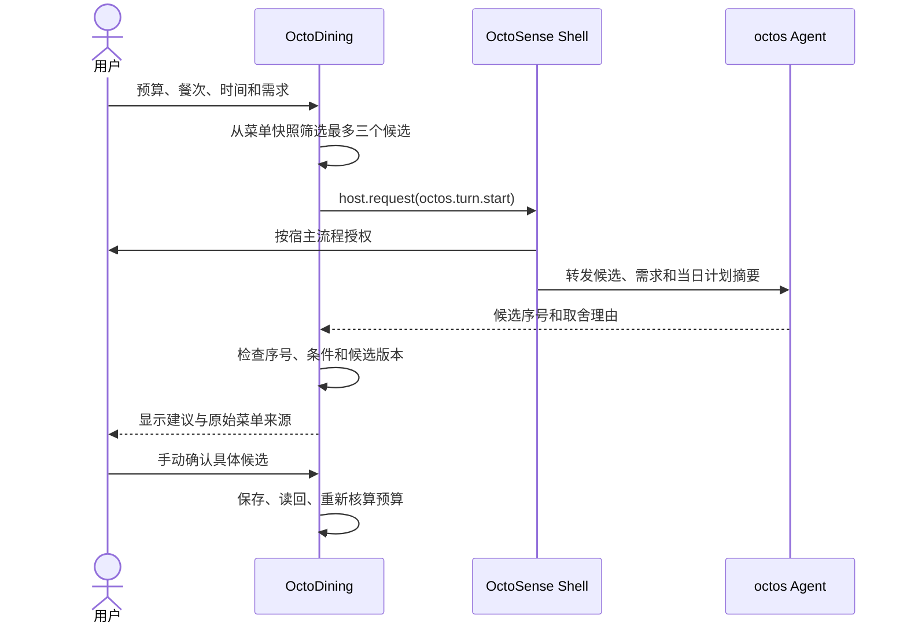

# 技术路线与宿主选择

路线决策日期：2026-10-03。当前比赛应用采用 OctoScript bundle，主要目标宿主为 OctoSense Shell。Rinx 是同一生态中可选的聊天和分享宿主；本项目不需要同时开发两个前端，也不需要把 octos 与 Rinx 二选一。octos 是宿主 Agent 服务，OctoSense/Rinx 是应用运行入口。

## 各组件的责任

| 组件 | 在 OctoDining 中的角色 |
| --- | --- |
| OctoDining | 餐饮规划、菜单筛选、预算核算、用户确认与本地计划 |
| OctoScript / Makepad | 描述界面、状态和事件，原生渲染应用 |
| OctoSense Shell | 运行应用，管理应用权限、Agent 服务、模型配置与审批 |
| octos | 宿主管理的运行时 Agent 内核，通过 `octos.turn.start` 接入 |
| App Hub / Design Flow | bundle 规范、构建、开发预览和准入检查 |
| card-host | 应用交互的开发预览，不注册系统 Agent 服务 |
| Rinx | 可选的聊天小程序入口；需要时复用 OctoScript 应用并按宿主要求集成 |
| octoscode / OctoLoop / hagency | 开发、审查与多 Agent 协作工具，按需使用，不是比赛应用的强制运行依赖 |

个人选餐任务先交付一个可运行应用。系统 Agent 负责比较筛选出来的候选；应用验证序号，用户确认，应用写入计划。Agent 不直接操作存储。

## 目标数据流

## 当前应用状态

- `scripts/main.splash.in` 是 OctoScript 源模板；`products_clean.json` 提供本地快照；`scripts/build-octos-bundle.py` 将它与 `menu.csv` 的商品图片 URL 对应，生成 `bundle/main.splash` 并将菜单价换算成整数分。
- `bundle/manifest.json` 声明 `storage`、`octos.turn.start` 与 `net`；`net` 仅允许从 `img.pospal.cn` 加载菜单图片，没有直连模型或实时菜单服务接口。
- 基本选餐与计划管理在 App Hub `card-host` 中有真实交互自动验收；验收报告保存于本地忽略目录 `.local-state/acceptance-*/results.json`。
- 系统 Agent 请求界面与候选序号校验已加入源码；card-host 不提供该服务。OctoSense Shell 已通过首次授权与 MiniMax-M3 真实请求，空计划下确认后写入并读回，见[验收记录](evidence/shell-minimax-clean-20261004.json)。
- 本机隐藏窗口的 `/g` 截图端点有时超时；另一次同版本 Shell 运行已成功取得[Agent 建议截图](evidence/shell-minimax-agent-20261004.png)及[计划读回截图](evidence/shell-minimax-plan-20261004.png)。

## 官方能力与实际边界

OctoScript 通过 `host.request("octos.turn.start", {text}, callback)` 请求 Agent；manifest 必须声明该服务能力，宿主管理模型配置和授权。此服务返回文本，应用需自行要求结构化格式并验证响应。它不证明 Agent 获得了应用工具，也不代表跨应用自动执行。

官方资料列出的额外运行条件和实现状态会随宿主版本变化。每次真实验收都应记录 OctoSense、App Hub、Makepad 和 OctoScript-Makepad 的固定提交号及构建配置。以目标宿主版本内的能力说明和成功/失败实测为准，不依赖过期课程讲义或仅对源码静态检查。

## 数据、安全与限制

- 菜单数据是本地快照；不提供实时库存、价钱、营养、过敏原或健康建议。
- 发送给 Agent 的内容限于本次用户需求、最多三个候选、预算和当天计划摘要。宿主按其 provider 设置将请求交给模型服务。
- 应用在用户确认后才保存。两份轮换 JSON 记录带版本和修订号，启动时选择较新有效版本，写入后读回校验。
- `card-host` 仅证明 bundle 普通交互和持久化，不证明 OctoSense Shell 授权或 Agent 可用。

## 来源

- [App Hub 发布规范](https://github.com/OctoSense-org/OctoSense-App-Hub/blob/main/docs/PUBLISHING.md)：服务能力和 manifest。
- [OctoScript 能力说明](https://github.com/OctoSense-org/OctoScript-App-Design-Flow/blob/main/docs/CAPABILITIES.md)：脚本应用可调用 API。
- [OctoSense AI 服务说明](https://github.com/OctoSense-org/OctoSense/blob/main/docs/ai-services.zh-CN.md)：宿主授权、provider 和服务限制。
- [Rinx 脚本小程序示例](https://github.com/hagency-org/Rinx/tree/main/examples/miniapps/matrix-octos-script)：同一 `host.request` 接口的另一宿主用法。
- [赛事交付说明](https://github.com/gosimfoundation/hackathon-agenticapp26/blob/main/docs/app-hub-submission.md)：作品运行与实际任务证据要求。
